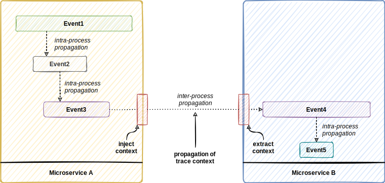

# Distributed Tracing with OpenTelemetry in .NET
## Introduction
This repository covers an exemplary implementation of distributed tracing in a microservices architecture using .NET. The generation of complete traces of an end-to-end request is depicted through the message broker [ActiveMQ](https://activemq.apache.org/). To obtain complete traces, the concepts known from OpenTelemetry regarding the [propagation of context](https://opentelemetry.io/docs/reference/specification/context/api-propagators/) and [semantic conventions](https://opentelemetry.io/docs/reference/specification/trace/semantic_conventions/messaging/) were applied. To enable the convenient mechanism of automatic instrumentation of processes communicating through the message broker, the [opentelemetry-dotnet-contrib](https://github.com/open-telemetry/opentelemetry-dotnet-contrib) repository has been forked and an [implementation for automatic instrumentation for ActiveMQ](https://github.com/gruabamike/opentelemetry-dotnet-contrib/tree/feature/activemq-instrumentation) has been added.

## Architecture


## Context Propagation


## Setup & Deployment
This chapter describes the setup and deployment process in order to run the prototype using automatic instrumentation of ActiveMQ.

### Prerequisites
### Setup Local NuGet Feed (BaGet via Docker)

* setup [BaGet docker image](https://loic-sharma.github.io/BaGet/installation/docker/)
    * setup BaGet in any directory (e.g. ```C:\src\BaGet```)
    * create file ```baget.env```
    * add folder ```baget-data```
    * run docker command in same folder as .env file ```docker run --rm --name nuget-server -p 5555:80 --env-file baget.env -v "$(pwd)/baget-data:/var/baget" loicsharma/baget:latest```
* make sure that you've installed [nuget.exe](https://www.nuget.org/downloads) (```>_ dotnet nuget```)

### Publish OpenTelemetry.Instrumentation.ActiveMQ Packages
* clone [opentelemetry-dotnet-contrib](https://github.com/gruabamike/opentelemetry-dotnet-contrib/tree/feature/activemq-instrumentation) and open the solution
* switch to the specified branch
* terminal: change directory to src folder "OpenTelemetry.Instrumentation.ActiveMQ"
* ```dotnet pack```
* navigate to specified output folder where the packages and symbols have been created
* push it to your local BaGet NuGet Feed 
* ```dotnet nuget push -k ${{NUGET-API-KEY}} -s http://localhost:5555/v3/index.json OpenTelemetry.Instrumentation.ActiveMQ.0.0.0-alpha.0.559.nupkg```
* ```dotnet nuget push -k ${{NUGET-API-KEY}} -s http://localhost:5555/v3/index.json OpenTelemetry.Instrumentation.ActiveMQ.0.0.0-alpha.0.559.snupkg```

### Entity Framework Migration
The tools can be installed as either a global or local tool. Most developers prefer installing dotnet ef as a global tool using the following command:
```dotnet tool install --global dotnet-ef```

Update the tool using the following command:
```dotnet tool update --global dotnet-ef```

### Run DistributedTracing via Docker-Compose
* clone this repository
* navigate to root project folder
* double check if the references nuget package version in the libraries matches the pushed ones
* ```docker-compose up```
* initial database migration (navigate to the following directories respectively: Users.Api, Orders.Api)
    * dotnet ef database update

### Example request
The following request can be executed (e.g. with [postman](https://www.postman.com/))

```json
POST /orders HTTP/1.1
Content-Type: application/json
User-Agent: PostmanRuntime/7.30.0
Accept: */*
Postman-Token: c0f043d2-dbad-45c8-832b-cf64667eebe3
Host: localhost:9001
Accept-Encoding: gzip, deflate, br
Connection: keep-alive
Content-Length: 136
 
{
  "userId": "00000000-0000-0000-0000-000000000001",
  "productId": "00000000-0000-0000-0000-000000000001",
  "quantity": 2
}
```

## Services
* BaGet: http://localhost:5555
* ActiveMQ: http://localhost:8161
* Zipkin: http://localhost:9411/zipkin
* Prometheus: http://localhost:9090
* Jaeger: http://localhost:16686
